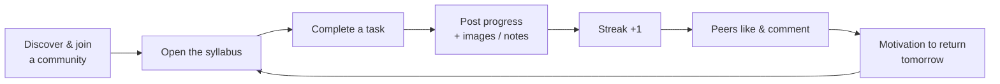
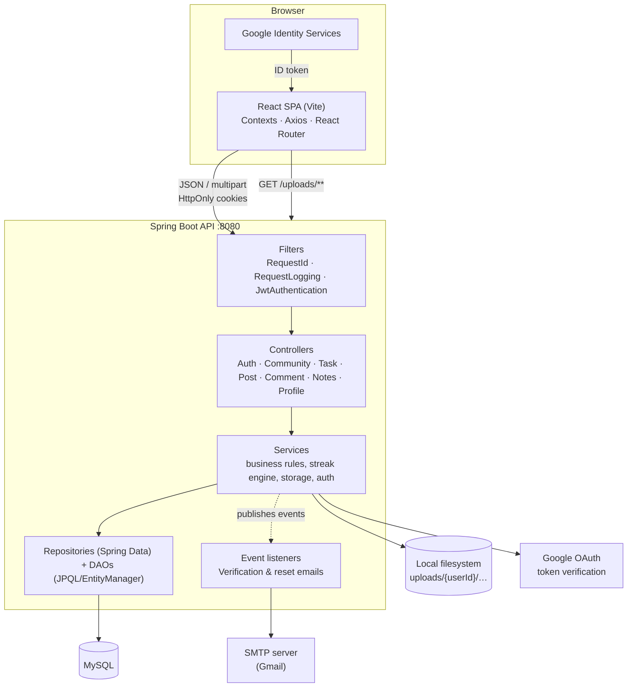
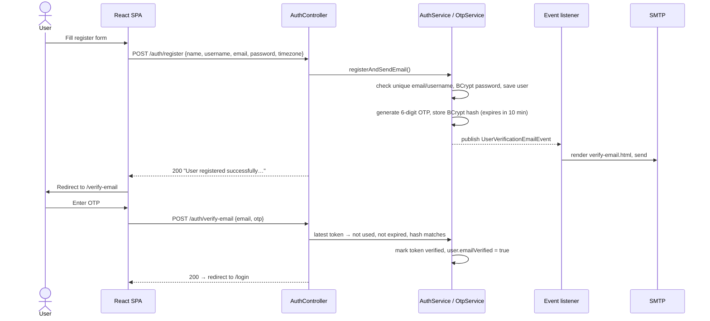
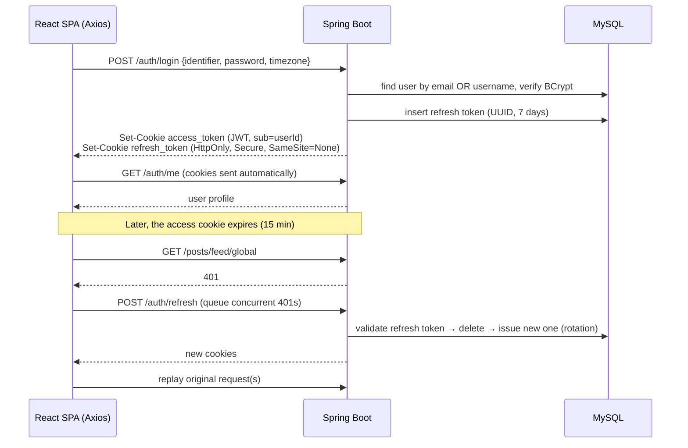
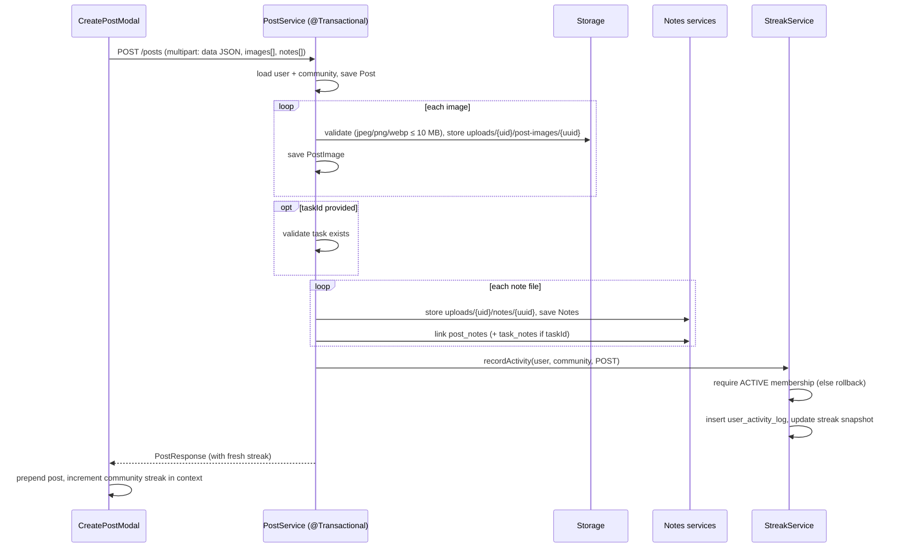

# Procial — Productive Social

> **A social network that rewards progress, not scrolling.**
> Join challenge-based learning communities, work through a structured syllabus, share daily progress and notes, and stay accountable with per-community streaks.


---

## Table of Contents

1. [Overview](#1-overview)
2. [Business Use Cases](#2-business-use-cases)
3. [Feature Set](#3-feature-set)
4. [Tech Stack](#4-tech-stack)
5. [System Architecture](#5-system-architecture)
6. [Repository Structure](#6-repository-structure)
7. [Data Model](#7-data-model)
8. [Core Workflows](#8-core-workflows)
9. [REST API Reference](#9-rest-api-reference)
10. [Security Model](#10-security-model)
11. [File Storage](#11-file-storage)
12. [Email & Notifications](#12-email--notifications)
13. [Frontend Architecture](#13-frontend-architecture)
14. [Getting Started](#14-getting-started)
15. [Configuration Reference](#15-configuration-reference)
16. [Logging, Errors & Observability](#16-logging-errors--observability)
17. [Deployment](#17-deployment)
18. [Known Limitations & Roadmap](#18-known-limitations--roadmap)
19. [Contributors](#19-contributors)

---

## 1. Overview

Most social platforms are designed to maximize time spent. **Procial** turns the social feed toward **productivity and learning**:

- **Communities** represent a goal or challenge, such as a DSA preparation track, a system design course, or an exam syllabus.
- Each community has a **Syllabus**: an ordered list of **Tasks** that members check off as they go.
- Members **post progress updates** ("What did you accomplish today?") with images and study **Notes** (PDF/DOC attachments).
- Every meaningful action (posting, completing a task) feeds a **streak engine** that tracks consecutive active days **per user, per community**, based on the user's own timezone.
- Peers **like**, **comment**, and **reply**, which adds social proof and accountability.

The project is a monorepo with two apps:

| App | Path | Description |
|---|---|---|
| **Backend** | [`backend/`](backend/) | Spring Boot 4 REST API (Java 21, JPA/Hibernate, Spring Security, JWT cookies, Google SSO, SMTP email) |
| **Frontend** | [`frontend/`](frontend/) | React 19 SPA built with Vite, React Router 7, Axios, Context-based state |

---

## 2. Business Use Cases

### 2.1 Problem statement

| Pain point | How Procial addresses it |
|---|---|
| Self-learners lose motivation after a few days | **Per-community streaks** and a longest-streak record turn consistency into a visible goal |
| Learning resources are scattered | **Structured syllabus** per community, with **notes linked to specific tasks** |
| Studying alone feels isolating | **Community feeds**, likes, and threaded comments create peer accountability |
| Progress is hard to see | **Task completion tracking**, profile stats (posts, communities, current and longest streak) |
| Good notes are rarely shared | **Notes library** per user, attachable to posts and to syllabus tasks for others to download |

### 2.2 Target personas

| Persona | Scenario |
|---|---|
| **Self-paced learner** | Joins "DSA in 60 Days", ticks off one topic per day, posts a short summary, and keeps a 45-day streak. |
| **Interview / placement candidate** | Follows a structured prep syllabus, downloads notes other members uploaded for each topic, and tracks what is left. |
| **Study group / college cohort** | A class joins one community. The community feed shows who is keeping up, and classmates share notes per chapter. |
| **Educator, bootcamp, or content creator** | Runs a challenge-based community with a curated syllabus (seeded by the operator) and uses member activity to gauge engagement. |
| **Corporate L&D team** | Runs internal upskilling tracks where employees post progress and share material in a closed deployment. |

### 2.3 Core engagement loop



### 2.4 Business rules enforced by the platform

- A user must be an **active member** of a community to post in it. Streak recording rejects non-members, and the post is rolled back.
- A streak counts **once per calendar day** in the **user's local timezone**. Several activities on the same day don't add to it.
- Missing a day **resets** the current streak. The **longest streak** is kept permanently.
- **Leaving** a community is a soft delete (`status = LEFT`). **Re-joining** resets the current streak to 0 but keeps the longest streak.
- Only the **author** can delete a post. Deletion cascades to images (including files on disk), likes, comments, and note links.
- Email/password accounts get a **6-digit OTP** that expires in 10 minutes. Password reset links expire in **30 minutes** and work **only once**.
- Google SSO users are **auto-provisioned** (or linked to an existing account with the same email) and are marked as email-verified.

### 2.5 Analytics potential

Every streak-relevant action is written to `user_activity_log` with both a **user-local date** (used for streak logic) and an **absolute UTC timestamp** (used for audits and analytics). This supports metrics such as DAU/WAU per community, streak retention curves, task-completion funnels, and the most engaging syllabus topics without changing the schema.

---

## 3. Feature Set

### Authentication & accounts
- Register with name, username, email, password, and auto-detected browser timezone
- Email verification using a 6-digit OTP (hashed at rest), with a resend option and a 60-second resend cooldown in the UI
- Login with **email or username**. The stored timezone is refreshed on each login.
- **Sign in with Google** (Google Identity Services ID token, verified server-side)
- Forgot/reset password through an emailed one-time link
- Stateless JWT access token plus a rotating refresh token, both in **HttpOnly cookies**
- Silent token refresh on `401` with a request queue on the client

### Communities
- Browse all communities with member count, joined state, and your current streak
- Grid or list view toggle (remembered in `localStorage`)
- Join and leave with optimistic UI and a leave confirmation modal
- Community page with **Feed** and **Syllabus** tabs (tab kept in the URL query string)

### Syllabus & tasks
- Ordered task list per community (`order_index`)
- Check or uncheck tasks. Completing a task records streak activity.
- "View Notes" per task lists every note linked to that topic

### Posts & feed
- Create posts with **title**, **description**, **community**, an optional **syllabus topic**, **multiple images** (JPEG/PNG/WebP, 10 MB each), and **multiple note files**
- Global feed (filtered on the client to joined communities), community feed, and per-user feed
- Offset pagination with **infinite scroll** (`IntersectionObserver`)
- Like and unlike with optimistic updates
- **Threaded comments** (replies to replies) through `parentCommentId`
- Streak and community badges on post cards
- Author-only delete
- Skeleton loaders for first load and pagination

### Notes
- Upload notes (PDF/DOC/DOCX in the UI) from the profile page, optionally linked to a syllabus task
- Notes attached to posts are automatically linked to the post's task, if one was selected
- Search your notes by filename. Download any note.
- View any user's public notes from their profile

### Profiles
- Profile header with avatar, name, bio, join date, and stats: **posts**, **active communities**, **current streak** (highest active streak across communities), **longest streak**
- Tabs: **Feed**, **Notes**, **Communities**
- Edit name, username, and bio. The profile picture uploads immediately (JPEG/PNG/WebP, 5 MB).
- View other users at `/profile/:username`

### UX
- Light and dark theme toggle that follows the system preference and is applied before first paint to avoid a flash
- Toast notifications ([sonner](https://sonner.emilkowal.ski/))
- Icon set from [lucide-react](https://lucide.dev/)

---

## 4. Tech Stack

### Backend

| Concern | Technology |
|---|---|
| Language / runtime | **Java 21** |
| Framework | **Spring Boot 4.0.0** (Web MVC, Data JPA, Security, Validation, Mail, Thymeleaf) |
| Build | Maven (wrapper included: `mvnw`, `mvnw.cmd`) |
| Persistence | Hibernate / JPA, `ddl-auto=update` |
| Database | **MySQL** (configured driver & dialect). The PostgreSQL driver is also on the classpath. |
| Connection pool | HikariCP (max 15, min idle 5, leak detection 15 s) |
| Auth | Spring Security (stateless), **JJWT 0.11.5** (HS256), BCrypt |
| SSO | `google-api-client` 2.5.0 (`GoogleIdTokenVerifier`) |
| Email | Spring Mail (SMTP, Gmail by default) with **Thymeleaf** HTML templates |
| Boilerplate | Lombok |
| Logging | SLF4J + Logback (console + async rolling file, MDC request IDs) |
| Container | Dockerfile based on `eclipse-temurin:21-jdk` |

### Frontend

| Concern | Technology |
|---|---|
| UI library | **React 19.2** |
| Build tool / dev server | **Vite 7** with `@vitejs/plugin-react` |
| Routing | **React Router DOM 7** |
| HTTP | **Axios** (`withCredentials`, 401 → refresh interceptor) |
| State | React Context (`AuthContext`, `CommunityContext`, `PostContext`, `ThemeContext`) |
| Notifications | sonner |
| Icons | lucide-react |
| Styling | Plain CSS, CSS custom properties (design tokens), per-component stylesheets |
| Linting | ESLint 9 (flat config) + react-hooks + react-refresh plugins |
| Language | JavaScript (JSX) |

---

## 5. System Architecture

### 5.1 High-level view



### 5.2 Backend layering

| Layer | Package | Responsibility |
|---|---|---|
| **Config** | `config`, root `CorsConfig` | Security filter chain, CORS, BCrypt bean, static `/uploads/**` mapping, upload base path, request ID and logging filters |
| **Security** | `security` | `JwtUtil` (issue/validate), `JwtAuthenticationFilter` (cookie → `SecurityContext`), `CustomUserDetails(Service)` |
| **SSO** | `authprovider` | Strategy + factory pattern: `AuthProviderVerifier` interface, `GoogleAuthProviderVerifier`, `AuthProviderService` (link or provision users) |
| **Controllers** | `controllers` | Thin REST endpoints that delegate to services |
| **Services** | `service` | Business logic, transactions, validation, streak engine, file handling |
| **Data access** | `repository`, `dao` | Spring Data JPA repositories for CRUD. Hand-written DAOs for aggregate and batch queries (feeds, profile stats, membership lookups). |
| **Storage** | `storage` | `GenericFileStorageService` (UUID file names, per-user folders), `UploadPathResolver` |
| **Email** | `email` | Provider-agnostic `EmailClient` (SMTP implementation), `EmailTemplateRenderer` (Thymeleaf implementation), `EmailProperties` |
| **Notification** | `notification` | Domain events (`UserVerificationEmailEvent`, `PasswordResetEmailEvent`) and their listeners |
| **Domain** | `entity`, `enums`, `dto` | JPA entities, enums, request/response DTOs |
| **Errors** | `exceptions` | Typed exceptions and `GlobalExceptionHandler` (`@ControllerAdvice`) |
| **Utilities** | `util`, `logging` | `CookieUtil`, `TimeUtil` (timezone-safe dates), `NoisyLogLimiter` |

**Patterns used:** layered architecture, Strategy/Factory (SSO providers), Observer (Spring application events for email), Ports & Adapters (the `EmailClient` and `ImageStorageService` interfaces), DTO projection, batch aggregation to avoid N+1 queries in feeds.

---

## 6. Repository Structure

```text
productive-social/
├── backend/
│   ├── Dockerfile
│   ├── pom.xml
│   ├── mvnw / mvnw.cmd
│   └── src/
│       ├── main/java/com/productive/social/
│       │   ├── SocialApplication.java          # Spring Boot entry point
│       │   ├── CorsConfig.java
│       │   ├── authprovider/                   # Google SSO (dto, factory, provider, service)
│       │   ├── config/                         # Security, filters, static resources, upload config
│       │   ├── controllers/                    # REST controllers
│       │   ├── dao/                            # EntityManager-based queries (feeds, profile, notes, streak)
│       │   ├── dto/                            # auth, comments, community, notes, posts, profile, task, exceptions
│       │   ├── email/                          # client, config, exception, model, template
│       │   ├── entity/                         # JPA entities
│       │   ├── enums/
│       │   ├── exceptions/                     # typed exceptions + GlobalExceptionHandler
│       │   ├── logging/
│       │   ├── notification/                   # events + listeners
│       │   ├── repository/                     # Spring Data repositories
│       │   ├── security/                       # JWT util, filter, user details
│       │   ├── service/                        # business logic
│       │   ├── storage/                        # filesystem storage
│       │   └── util/                           # CookieUtil, TimeUtil
│       ├── main/resources/
│       │   ├── application.properties
│       │   ├── logback-spring.xml
│       │   └── templates/email/                # verify-email.html, reset-password.html
│       └── test/java/…/SocialApplicationTests.java
│
└── frontend/
    ├── index.html                              # loads Google GSI script + pre-paint theme
    ├── vite.config.js
    ├── eslint.config.js
    ├── package.json
    ├── .env                                    # VITE_API_URL, VITE_GOOGLE_CLIENT_ID
    ├── utils/TimeAgo.js
    └── src/
        ├── main.jsx                            # providers: Router → Auth → Community → Post → Theme
        ├── App.jsx                             # route table
        ├── app/                                # route-level pages (folder-per-route)
        │   ├── home/  login/  register/  verify-email/  forgot-password/  reset-password/
        │   ├── communities/  communities/[id]/
        │   ├── profile/[username]/  accounts/edit-profile/  notes/
        ├── components/
        │   ├── auth/  community/  feed/  layout/  notes/  profile/
        │   └── ui/                             # design-system primitives (Button, Modal, Tabs, Skeleton…)
        ├── context/                            # AuthContext, CommunityContext, PostContext, ThemeContext
        ├── hooks/                              # useInfiniteScroll, useLeaveCommunity, usePasswordToggle
        ├── lib/                                # api.js (Axios client + endpoints), downloadFile.js
        ├── assets/                             # icons, auth illustrations
        └── styles/                             # variables.css (tokens), globals.css, animations.css
```

---

## 7. Data Model

Hibernate creates and updates the schema from the entities (`spring.jpa.hibernate.ddl-auto=update`).

```mermaid
erDiagram
    USERS ||--o{ USER_AUTH_PROVIDERS : "has SSO identities"
    USERS ||--o{ REFRESH_TOKENS : owns
    USERS ||--o{ EMAIL_VERIFICATION_TOKENS : receives
    USERS ||--o{ PASSWORD_RESET_TOKENS : requests
    USERS ||--o{ USER_COMMUNITIES : "member of"
    COMMUNITIES ||--o{ USER_COMMUNITIES : has
    COMMUNITIES ||--o{ TASKS : "syllabus"
    USERS ||--o{ USER_TASK_PROGRESS : tracks
    TASKS ||--o{ USER_TASK_PROGRESS : "progress of"
    USERS ||--o{ POSTS : writes
    COMMUNITIES ||--o{ POSTS : contains
    POSTS ||--o{ POST_IMAGES : has
    POSTS ||--o{ POST_LIKES : receives
    USERS ||--o{ POST_LIKES : gives
    POSTS ||--o{ COMMENTS : has
    COMMENTS ||--o{ COMMENTS : "replies"
    USERS ||--o{ NOTES : uploads
    POSTS ||--o{ POST_NOTES : links
    NOTES ||--o{ POST_NOTES : "linked to"
    TASKS ||--o{ TASK_NOTES : links
    NOTES ||--o{ TASK_NOTES : "linked to"
    USERS ||--o{ USER_ACTIVITY_LOG : generates
    COMMUNITIES ||--o{ USER_ACTIVITY_LOG : scopes

    USERS {
        bigint id PK
        varchar username UK
        varchar email UK
        varchar password "BCrypt, null for SSO-only"
        varchar name
        varchar bio
        varchar profile_picture
        varchar timezone "IANA zone, e.g. Asia/Kolkata"
        tinyint email_verified
        datetime created_at
        datetime updated_at
    }
    COMMUNITIES {
        bigint id PK
        varchar name UK
        text description
        varchar image
        enum status "ACTIVE | LEFT | BANNED"
        datetime created_at
    }
    USER_COMMUNITIES {
        bigint id PK
        bigint user_id FK
        bigint community_id FK
        enum status "ACTIVE | LEFT"
        int current_streak
        int longest_streak
        date last_activity_date "user-local date"
        datetime joined_at
    }
    TASKS {
        bigint id PK
        bigint community_id FK
        varchar title
        text description
        int order_index
        datetime created_at
    }
    USER_TASK_PROGRESS {
        bigint id PK
        bigint user_id FK
        bigint task_id FK
        boolean completed
        datetime completed_at
    }
    POSTS {
        bigint id PK
        bigint user_id FK
        bigint community_id FK
        text title
        text content
        bigint note_attachment_id "reserved"
        timestamp created_at
        timestamp updated_at
    }
    POST_IMAGES {
        bigint id PK
        bigint post_id FK
        varchar image_url "relative: uploads/{userId}/post-images/…"
        int ordering
    }
    POST_LIKES {
        bigint id PK
        bigint post_id FK
        bigint user_id FK
        timestamp created_at
    }
    COMMENTS {
        bigint id PK
        bigint post_id FK
        bigint user_id FK
        bigint parent_comment_id FK "null = top-level"
        text content
        timestamp created_at
    }
    NOTES {
        bigint id PK
        bigint user_id
        varchar original_file_name
        varchar stored_file_name
        varchar file_path
        varchar content_type
        bigint file_size
        enum visibility "PUBLIC | PRIVATE"
        datetime created_at
    }
    POST_NOTES {
        bigint id PK
        bigint post_id
        bigint notes_id
        datetime linked_at
    }
    TASK_NOTES {
        bigint id PK
        bigint task_id
        bigint notes_id
        datetime linked_at
    }
    USER_ACTIVITY_LOG {
        bigint id PK
        bigint user_id FK
        bigint community_id FK
        enum activity_type
        date activity_date "user-local"
        timestamp created_at_utc
    }
    USER_AUTH_PROVIDERS {
        bigint id PK
        bigint user_id FK
        enum auth_provider "LOCAL | GOOGLE"
        varchar auth_provider_id
        datetime created_at
    }
    REFRESH_TOKENS {
        bigint id PK
        bigint user_id FK
        varchar token UK
        timestamp expiry_date
        timestamp created_at
    }
    EMAIL_VERIFICATION_TOKENS {
        bigint id PK
        bigint user_id FK
        varchar otp_hash
        datetime expires_at
        boolean verified
    }
    PASSWORD_RESET_TOKENS {
        bigint id PK
        bigint user_id FK
        varchar token_hash
        datetime expires_at
        boolean used
    }
    SYSTEM_CONFIG {
        varchar config_key PK
        varchar config_value
    }
```



**Unique constraints:** `users(username)`, `users(email)`, `communities(name)`, `user_communities(user_id, community_id)`, `user_task_progress(user_id, task_id)`, `post_likes(post_id, user_id)`, `post_notes(post_id, notes_id)`, `task_notes(task_id, notes_id)`, `refresh_tokens(token)`.

**Indexes:** `user_activity_log(user_id, activity_date)`, `user_activity_log(user_id, community_id, activity_date)`.

**Enums:**

| Enum | Values |
|---|---|
| `ActivityType` | `POST`, `COMMENT`, `TASK_COMPLETED`, `NOTE_CREATED`, `DAILY_CHECKIN`, `OTHER` (only `POST` and `TASK_COMPLETED` are recorded today) |
| `AuthProvider` | `LOCAL`, `GOOGLE` |
| `MembershipStatus` | `ACTIVE`, `LEFT` |
| `CommunityStatus` | `ACTIVE`, `LEFT`, `BANNED` |
| `NotesVisibility` | `PUBLIC`, `PRIVATE` (all uploads are currently `PUBLIC`) |
| `UploadType` | `PROFILE_PICTURE` → `profile-picture/`, `POST_IMAGE` → `post-images/`, `NOTES` → `notes/` |

---

## 8. Core Workflows

### 8.1 Registration & email verification



### 8.2 Login, session & silent refresh



### 8.3 Google SSO

1. The frontend loads Google Identity Services (`accounts.google.com/gsi/client`) and receives an **ID token**.
2. `POST /auth/sso { authProvider: "GOOGLE", token }`.
3. `AuthProviderFactory` selects `GoogleAuthProviderVerifier`, which checks the token signature and audience against `GOOGLE_CLIENT_ID`.
4. `AuthProviderService` resolves the user:
   - an existing `user_auth_providers` row for this Google subject → log in
   - otherwise, an existing user with the same email → **link** the Google identity
   - otherwise → **create** a user (username derived from the email's local part and de-duplicated, `emailVerified = true`, timezone `UTC`, no password)
5. The server issues the same cookie pair as a normal login. Password login is refused for SSO-only accounts.

### 8.4 Creating a post (and recording a streak)



### 8.5 Streak engine

The logic lives in [`StreakService`](backend/src/main/java/com/productive/social/service/StreakService.java). Streaks are stored as a snapshot on `user_communities`, and every activity is also appended to `user_activity_log`.

**On each activity** (`today` = current date in the user's IANA timezone, falling back to UTC):

| Condition | Result |
|---|---|
| `lastActivityDate == null` | `current = 1`, `longest = 1` |
| `lastActivityDate == today` | no change (same-day duplicate) |
| `lastActivityDate + 1 day == today` | `current += 1` |
| any larger gap | `current = 1` (streak broken) |
| always (except same-day) | `lastActivityDate = today`, `longest = max(longest, current)` |

**Displayed ("effective") streak.** Reads never write to the database. If the gap between `lastActivityDate` and today is more than one day, the streak is shown as **0**, even though the snapshot updates only on the next activity. A user therefore has until the end of the next local day to keep a streak alive.

**Streak triggers:** creating a post (`POST`) and marking a task complete (`TASK_COMPLETED`).

### 8.6 Password reset

1. `POST /auth/forgot-password?email=…` generates a random UUID token. Its BCrypt hash is stored with a 30-minute expiry.
2. The email links to `${FRONTEND_URL}/reset-password?token=<raw-token>`.
3. `POST /auth/reset-password { token, newPassword }` matches the hash, checks that the token is unused and unexpired, updates the password, and marks the token used.

---

## 9. REST API Reference

**Base URL:** `http://localhost:8080` (configurable through `PORT`).
**Auth:** endpoints marked 🔒 require the `access_token` and `refresh_token` cookies. Send requests with `credentials: include` or `withCredentials: true`.
**Content type:** JSON unless marked *multipart*.

### Auth — `/auth`

| Method | Path | Auth | Body / Params | Description |
|---|---|---|---|---|
| POST | `/auth/register` | — | `{ name, username, email, password, timezone }` | Create account and send verification OTP |
| POST | `/auth/verify-email` | — | `{ email, otp }` | Verify email with OTP |
| POST | `/auth/resend-verification` | — | `{ email }` | Send a new OTP |
| POST | `/auth/login` | — | `{ identifier, password, timezone? }` | Login with email or username. Sets cookies. |
| POST | `/auth/sso` | — | `{ authProvider: "GOOGLE", token }` | Google login/signup. Sets cookies. |
| POST | `/auth/refresh` | refresh cookie | — | Rotate refresh token and issue a new access token |
| POST | `/auth/logout` | — | — | Revoke refresh token and clear cookies |
| POST | `/auth/forgot-password` | — | query `?email=` | Email a reset link |
| POST | `/auth/reset-password` | — | `{ token, newPassword }` | Reset password |
| GET | `/auth/me` | 🔒 | — | Current user (`id, username, name, email, profilePicture, bio, joinedCommunitiesCount, createdAt`) |

### Communities — `/communities`

| Method | Path | Auth | Body | Description |
|---|---|---|---|---|
| GET | `/communities` | 🔒 | — | All communities with `joined`, `memberCount`, `streak` for the current user |
| GET | `/communities/me` | 🔒 | — | Communities the current user has joined |
| GET | `/communities/user/{username}` | 🔒 | — | Communities a given user has joined |
| GET | `/communities/{communityId}` | 🔒 | — | Community details |
| POST | `/communities/join` | 🔒 | `{ communityId }` | Join or re-join |
| POST | `/communities/{communityId}/leave` | 🔒 | — | Leave (soft delete) |

### Syllabus / Tasks

| Method | Path | Auth | Body | Description |
|---|---|---|---|---|
| GET | `/communities/{communityId}/tasks` | 🔒 | — | Ordered tasks with the user's `completed` / `completedAt` |
| POST | `/communities/{communityId}/tasks/update` | 🔒 | `{ taskId, completed }` | Mark complete (records streak) or incomplete |
| GET | `/tasks/{taskId}/notes` | 🔒 | — | Notes linked to a task |
| POST | `/tasks/{taskId}/notes/{notesId}` | 🔒 | — | Link an existing note to a task |

### Posts — `/posts`

| Method | Path | Auth | Body / Params | Description |
|---|---|---|---|---|
| POST | `/posts` | 🔒 | *multipart*: `data` (JSON `{ communityId, title, content, taskId? }`), `images[]?`, `notes[]?` | Create a post |
| GET | `/posts/feed/global` | 🔒 | `?page=0&pageSize=10` | Newest posts across all communities |
| GET | `/posts/feed/community/{communityId}` | 🔒 | `?page&pageSize` | Community feed |
| GET | `/posts/feed/me` | 🔒 | `?page&pageSize` | Current user's posts |
| GET | `/posts/feed/{username}` | 🔒 | `?page&pageSize` | A user's posts |
| POST | `/posts/{postId}/like` | 🔒 | — | Like (idempotent) |
| DELETE | `/posts/{postId}/like` | 🔒 | — | Unlike |
| DELETE | `/posts/{postId}` | 🔒 | — | Delete own post (`204`) |
| POST | `/posts/{postId}/notes/{notesId}` | 🔒 | — | Link an existing note to a post |

<details>
<summary><strong>PostResponse</strong> shape</summary>

```json
{
  "postId": 42,
  "user": { "id": 7, "username": "abhinav", "name": "Abhinav", "profilePicture": "uploads/7/profile-picture/…webp", "streak": 0 },
  "community": { "id": 3, "name": "DSA in 60 Days", "streak": 12 },
  "title": "Finished sliding window problems",
  "content": "Solved 6 problems today…",
  "images": [{ "imageUrl": "uploads/7/post-images/…png", "ordering": null }],
  "notes": [{ "id": 11, "originalFileName": "sliding-window.pdf", "fileSize": 182340, "notesUrl": "uploads/7/notes/…pdf" }],
  "likesCount": 5,
  "commentsCount": 2,
  "likedByCurrentUser": true,
  "createdAt": "2026-01-20T14:05:11.000+00:00"
}
```
</details>

### Comments — `/comments`

| Method | Path | Auth | Body | Description |
|---|---|---|---|---|
| POST | `/comments` | 🔒 | `{ postId, content, parentCommentId? }` | Add a comment or reply |
| GET | `/comments/post/{postId}` | 🔒 | — | Top-level comments with nested `replies[]` |

### Notes — `/notes`

| Method | Path | Auth | Body | Description |
|---|---|---|---|---|
| POST | `/notes` | 🔒 | *multipart*: `file`, `data?` (JSON `{ taskId? }`) | Upload a note, optionally linked to a task |
| GET | `/notes/me` | 🔒 | — | Current user's notes |
| GET | `/notes/{username}` | 🔒 | — | A user's notes |
| GET | `/notes/{notesId}/download` | 🔒 | — | Download file (`Content-Disposition: attachment`) |
| GET | `/notes/{notesId}/posts` | 🔒 | — | IDs of posts that reference this note |

### Profile — `/profile`

| Method | Path | Auth | Body | Description |
|---|---|---|---|---|
| GET | `/profile/me` | 🔒 | — | Current user's profile + stats |
| GET | `/profile/{username}` | 🔒 | — | Public profile + stats |
| PATCH | `/profile/me` | 🔒 | `{ username?, name?, bio?, email? }` | Partial update (uniqueness checked) |
| POST | `/profile/me/profile-picture` | 🔒 | *multipart*: `file` | Replace avatar (JPEG/PNG/WebP ≤ 5 MB) |

### Static files

| Method | Path | Auth | Description |
|---|---|---|---|
| GET | `/uploads/**` | — | Serves uploaded images and files from the backend's `uploads/` directory |

---

## 10. Security Model

| Aspect | Implementation |
|---|---|
| Session model | **Stateless**. No server session (`SessionCreationPolicy.STATELESS`). |
| Access token | JWT (HS256), `sub = userId`, 24 h `exp` claim, delivered in the `access_token` cookie with a **15-minute** max-age |
| Refresh token | Random UUID stored in `refresh_tokens`, **7-day** expiry, **rotated** on every refresh, deleted on logout |
| Cookies | `HttpOnly`, `Secure`, `SameSite=None`, `Path=/`. Not readable by JavaScript, which mitigates XSS token theft. |
| Request auth | `JwtAuthenticationFilter` reads both cookies, validates the JWT, loads the user by ID, and populates the `SecurityContext`. A missing or invalid token returns `401`. |
| Public routes | `/auth/login`, `/auth/register`, `/auth/verify-email`, `/auth/resend-verification`, `/auth/forgot-password`, `/auth/reset-password`, `/auth/refresh`, `/auth/logout`, `/auth/sso`, `/uploads/**` |
| Passwords | BCrypt (`BCryptPasswordEncoder`) |
| OTP & reset tokens | Stored only as BCrypt hashes, with expiry and single-use flags |
| SSO | Google ID token verified server-side against the configured client ID (audience check) |
| CSRF | Disabled (API authenticated by cookies with `SameSite=None`; see [limitations](#18-known-limitations--roadmap)) |
| CORS | All origin patterns allowed, credentials enabled |
| Headers | `Cross-Origin-Opener-Policy: same-origin-allow-popups` (required for the Google sign-in popup) |
| Authorization | Ownership check on post deletion. Membership check when recording streaks. A single `USER` authority exists. |
| Log hygiene | Failed login attempts are logged through a rate limiter (`NoisyLogLimiter`) to avoid log flooding |

---

## 11. File Storage

Uploads are stored on the **local filesystem** under a per-user folder:

```text
{UPLOAD_BASE_PATH}/uploads/{userId}/profile-picture/{uuid}.{ext}
{UPLOAD_BASE_PATH}/uploads/{userId}/post-images/{uuid}.{ext}
{UPLOAD_BASE_PATH}/uploads/{userId}/notes/{uuid}.{ext}
```

- **Base path resolution** ([`UploadConfigService`](backend/src/main/java/com/productive/social/config/UploadConfigService.java)): read once at startup from the `system_config` table (`config_key = 'UPLOAD_BASE_PATH'`). If that row is absent, the JVM working directory (`user.dir`) is used.
- The database stores the **relative** path (`uploads/…`). The frontend builds image URLs as `${VITE_API_URL}/${path}`.
- `StaticResourceConfig` serves `/uploads/**` from `file:uploads/`, relative to the backend's working directory. Keep the base path equal to the working directory, or leave the row unset, so that stored files and served files match.
- File names are replaced with UUIDs. Only the extension is kept. The original name is stored for notes.
- **Validation:** images must be `image/jpeg`, `image/png`, or `image/webp`. Post images may be up to 10 MB and profile pictures up to 5 MB. Multipart requests are capped at 10 MB (`spring.servlet.multipart.*`).
- The previous avatar is deleted when a new one is uploaded. Post images are deleted with their post.

---

## 12. Email & Notifications

```text
AuthService / PasswordResetService
        │  publishEvent(...)
        ▼
UserVerificationEmailListener / PasswordResetEmailListener   (@EventListener)
        │  EmailTemplateRenderer.render("verify-email" | "reset-password", vars)
        ▼
ThymeleafEmailTemplateRenderer  →  templates/email/*.html
        │
        ▼
EmailNotificationService → EmailClient (SmtpEmailClient → JavaMailSender)
```

| Email | Template | Variables | Trigger |
|---|---|---|---|
| Verify your email | `verify-email.html` | `name`, `otp` | Register, resend verification |
| Reset your password | `reset-password.html` | `name`, `resetLink` | Forgot password |

To move to another email provider (for example SES or SendGrid), write a new `EmailClient` implementation. The services and listeners don't need to change.

---

## 13. Frontend Architecture

### 13.1 Routing ([`App.jsx`](frontend/src/App.jsx))

| Route | Page | Access |
|---|---|---|
| `/login` | Login (email/username + password, Google) | Public |
| `/register` | Registration | Public |
| `/verify-email` | OTP entry + resend | Public |
| `/forgot-password` | Request reset link | Public |
| `/reset-password?token=` | Set new password | Public |
| `/` | Home: global feed of joined communities + New Post | 🔒 `ProtectedRoute` |
| `/communities` | Community directory (grid/list) | 🔒 |
| `/communities/:id?tab=Feed\|Syllabus` | Community feed & syllabus | 🔒 |
| `/profile`, `/profile/:username?tab=Feed\|Notes\|Communities` | Profile | 🔒 |
| `/accounts/edit-profile` | Edit profile & avatar | 🔒 |
| `/notes` | Placeholder (notes live in the Profile → Notes tab) | 🔒 |

`ProtectedRoute` shows a full-page spinner until `AuthContext` has finished its first `/auth/me` check (with a refresh attempt), then either renders the page or redirects to `/login` with the original path saved for the post-login redirect.

### 13.2 State management

Provider order in [`main.jsx`](frontend/src/main.jsx): `BrowserRouter → AuthProvider → CommunityProvider → PostProvider → ThemeProvider`.

| Context | Holds | Key behaviors |
|---|---|---|
| `AuthContext` | `user`, `initialized`, `loading`, `authLoading` | Bootstraps the session (`/auth/me`, refreshing on failure), login, Google login, register, verify, resend, logout |
| `CommunityContext` | `communities`, `syllabusMap` (cached per community) | Sorts joined communities first, then by member count. Optimistic join/leave and task toggles with rollback. Local streak increment after posting. |
| `PostContext` | Normalized `posts` list, per-feed `page` / `hasMore` / `loading` | Merge and dedupe by `postId`, sort by `createdAt`. Infinite-scroll loaders for global, community, and user feeds. Optimistic like/unlike and delete. Comment count updates. |
| `ThemeContext` | `theme` | Persists to `localStorage`, follows OS changes when the user hasn't chosen a theme |

### 13.3 API client ([`lib/api.js`](frontend/src/lib/api.js))

- A single Axios instance with `baseURL = VITE_API_URL` and `withCredentials: true`.
- **Response interceptor:** on `401`, calls `POST /auth/refresh` once, **queues** concurrent failing requests, and replays them after the refresh succeeds. Auth endpoints and requests made from auth pages are excluded to prevent loops.
- One exported function per endpoint (for example `getGlobalPosts`, `createPost`, `updateCommunityTask`).

### 13.4 UI system

- **Primitives** in `components/ui/`: `Avatar`, `Badge`, `Button`, `Card`, `Checkbox`, `CloseButton`, `Input`, `Modal`, `ModalHeader`, `SearchBar`, `Select`, `Skeleton`, `Tabs`, `TextArea`, `ThemeToggle`, `Tooltip`.
- **Design tokens** in `styles/variables.css`: brand colors (blue `#2563eb` → purple `#7d5af4` gradient), gray scale, surfaces, text, borders, radii, and the Poppins font. Light and dark palettes switch through `[data-theme]`.
- **Page folders** use a Next.js-style `app/<route>/page.jsx` layout for organization only. Routing itself is handled by React Router.

---

## 14. Getting Started

### 14.1 Prerequisites

| Tool | Version |
|---|---|
| JDK | **21** |
| Node.js | **20.19+ or 22.12+** (required by Vite 7) |
| MySQL | **8.x** |
| An SMTP account | e.g. Gmail with an [App Password](https://support.google.com/accounts/answer/185833) |
| Google OAuth Client ID | Optional, only for "Sign in with Google" |

### 14.2 Clone

```bash
git clone https://github.com/AbhinavMuthyala19/productive-social.git
cd productive-social
```

### 14.3 Database

```sql
CREATE DATABASE productive_social CHARACTER SET utf8mb4 COLLATE utf8mb4_unicode_ci;
```

Tables are created automatically on the backend's first start.

### 14.4 Google OAuth (optional)

1. Open [Google Cloud Console → Credentials](https://console.cloud.google.com/apis/credentials) and create an **OAuth 2.0 Client ID** of type *Web application*.
2. Add `http://localhost:5173` to **Authorized JavaScript origins**.
3. Use the same client ID for `GOOGLE_CLIENT_ID` (backend) and `VITE_GOOGLE_CLIENT_ID` (frontend).

### 14.5 Run the backend

Set the environment variables (see [Configuration Reference](#15-configuration-reference)).

**macOS / Linux (bash):**

```bash
cd backend
export DB_URL="jdbc:mysql://localhost:3306/productive_social"
export DB_USERNAME="root"
export DB_PASSWORD="your-db-password"
export MAIL_USERNAME="you@gmail.com"
export MAIL_PASSWORD="your-gmail-app-password"
export GOOGLE_CLIENT_ID="xxxxxxxx.apps.googleusercontent.com"
export FRONTEND_URL="http://localhost:5173"
./mvnw spring-boot:run
```

**Windows (PowerShell):**

```powershell
cd backend
$env:DB_URL="jdbc:mysql://localhost:3306/productive_social"
$env:DB_USERNAME="root"
$env:DB_PASSWORD="your-db-password"
$env:MAIL_USERNAME="you@gmail.com"
$env:MAIL_PASSWORD="your-gmail-app-password"
$env:GOOGLE_CLIENT_ID="xxxxxxxx.apps.googleusercontent.com"
$env:FRONTEND_URL="http://localhost:5173"
.\mvnw.cmd spring-boot:run
```

The API starts on **http://localhost:8080**.

### 14.6 Seed communities & syllabus

There is no admin UI or API for creating communities and tasks yet. After the backend has started once (so the tables exist), seed them with SQL:

```sql
INSERT INTO communities (name, description, image, status, created_at) VALUES
  ('DSA in 60 Days',  'Master data structures & algorithms, one topic a day.', NULL, 'ACTIVE', NOW()),
  ('System Design',   'From fundamentals to large-scale architectures.',        NULL, 'ACTIVE', NOW()),
  ('Full-Stack Web',  'Build and ship a production web app.',                   NULL, 'ACTIVE', NOW());

-- Syllabus for community id 1
INSERT INTO tasks (community_id, title, description, order_index, created_at) VALUES
  (1, 'Arrays & Hashing',    'Two-sum, frequency maps, prefix sums', 1, NOW()),
  (1, 'Two Pointers',        'Pair sums, partitioning, dedup',       2, NOW()),
  (1, 'Sliding Window',      'Fixed & variable windows',             3, NOW()),
  (1, 'Stacks',              'Monotonic stacks, parsing',            4, NOW()),
  (1, 'Binary Search',       'On arrays and on answers',             5, NOW());

-- Optional: pin the upload base path (defaults to the backend working directory)
-- INSERT INTO system_config (config_key, config_value) VALUES ('UPLOAD_BASE_PATH', '/absolute/path/to/backend');
```

### 14.7 Run the frontend

```bash
cd frontend
npm install
```

Create or update `frontend/.env`:

```dotenv
VITE_API_URL=http://localhost:8080
VITE_GOOGLE_CLIENT_ID=xxxxxxxx.apps.googleusercontent.com
```

```bash
npm run dev
```

Open **http://localhost:5173**, register, verify with the emailed OTP, log in, join a community, and publish your first post.

> **Cookies in local development:** auth cookies are `Secure` with `SameSite=None`. Modern browsers accept `Secure` cookies on `http://localhost`, and `localhost:5173` → `localhost:8080` counts as same-site. In production, serve both apps over **HTTPS**.

### 14.8 Useful scripts

| Location | Command | Purpose |
|---|---|---|
| `backend/` | `./mvnw spring-boot:run` | Run API in dev |
| `backend/` | `./mvnw clean package` | Build `target/social-0.0.1-SNAPSHOT.jar` |
| `backend/` | `./mvnw test` | Run tests (needs a reachable database) |
| `frontend/` | `npm run dev` | Vite dev server with HMR |
| `frontend/` | `npm run build` | Production build to `dist/` |
| `frontend/` | `npm run preview` | Preview the production build |
| `frontend/` | `npm run lint` | ESLint |

---

## 15. Configuration Reference

### Backend environment variables ([`application.properties`](backend/src/main/resources/application.properties))

| Variable | Required | Default | Description |
|---|---|---|---|
| `PORT` | No | `8080` | HTTP port |
| `DB_URL` | **Yes** | — | JDBC URL, e.g. `jdbc:mysql://localhost:3306/productive_social` |
| `DB_USERNAME` | **Yes** | — | Database user |
| `DB_PASSWORD` | **Yes** | — | Database password |
| `MAIL_USERNAME` | **Yes** | — | SMTP username, also used as the *From* address |
| `MAIL_PASSWORD` | **Yes** | — | SMTP password or app password |
| `GOOGLE_CLIENT_ID` | **Yes**\* | — | Google OAuth client ID used as the token audience (\*the property must resolve for startup) |
| `FRONTEND_URL` | **Yes** | — | Base URL used to build password-reset links |
| `UPLOAD_BASE_PATH` | No | `/tmp/uploads` | Bound to `app.upload.base-path`. The effective path currently comes from `system_config` ([§11](#11-file-storage)). |

### Notable fixed settings

| Setting | Value |
|---|---|
| SMTP host / port | `smtp.gmail.com:587`, STARTTLS |
| JPA DDL | `update` |
| SQL logging | off (`spring.jpa.show-sql=false`) |
| Multipart limits | 10 MB file / 10 MB request |
| Hikari pool | `SocialHikariPool`, max 15, min idle 5, connection timeout 30 s, max lifetime 30 min |
| OTP expiry | 10 min (`OtpService`) |
| Reset token expiry | 30 min (`PasswordResetService`) |
| Refresh token TTL | 7 days (`RefreshTokenService`, `CookieUtil`) |
| Access cookie max-age | 15 min (`CookieUtil`) |

### Frontend environment variables

| Variable | Required | Description |
|---|---|---|
| `VITE_API_URL` | **Yes** | Backend base URL |
| `VITE_GOOGLE_CLIENT_ID` | For SSO | Google OAuth client ID |

---

## 16. Logging, Errors & Observability

### Logging ([`logback-spring.xml`](backend/src/main/resources/logback-spring.xml))

- **Console** appender for development.
- **Async rolling file** at `logs/app.log`, rolled daily and at 10 MB, kept for 30 days with a 1 GB total cap.
- Each request gets a UUID `requestId` in the MDC (included in file log lines), and a log line is written when the request starts and when it completes.
- Structured key/value log messages (e.g. `Post created successfully. userId=7, postId=42`).

### Error responses

All handled errors return a consistent JSON body from [`GlobalExceptionHandler`](backend/src/main/java/com/productive/social/exceptions/GlobalExceptionHandler.java):

```json
{
  "status": 404,
  "code": "NOT_FOUND",
  "message": "Community not found",
  "timestamp": "2026-01-20T14:05:11.123"
}
```

| Exception | HTTP status |
|---|---|
| `BadRequestException` | 400 |
| `UnauthorizedException` | 401 |
| `ForbiddenException` | 403 |
| `NotFoundException` (incl. `CommunityNotFoundException`) | 404 |
| `InternalServerException` (incl. `PostCreationException`, `PostImageUploadException`) | 500 |
| Any other exception | 500, `"Something went wrong"` |

An exception class can override the `code` field by exposing a `getErrorCode()` method.

---

## 17. Deployment

### Backend (Docker)

```bash
cd backend
docker build -t procial-api .
docker run -p 8080:8080 \
  -e DB_URL="jdbc:mysql://<host>:3306/productive_social" \
  -e DB_USERNAME=... -e DB_PASSWORD=... \
  -e MAIL_USERNAME=... -e MAIL_PASSWORD=... \
  -e GOOGLE_CLIENT_ID=... \
  -e FRONTEND_URL="https://your-frontend.example.com" \
  -v procial-uploads:/app/uploads \
  procial-api
```

The image builds the JAR with the Maven wrapper (`-DskipTests`) and runs it on port 8080. Mount a **persistent volume** at `/app/uploads`, because uploads are written to local disk.

### Frontend

```bash
cd frontend
VITE_API_URL="https://api.example.com" VITE_GOOGLE_CLIENT_ID="..." npm run build
```

Deploy `dist/` to any static host (Vercel, Netlify, S3 + CloudFront, Nginx). Configure an **SPA fallback** (rewrite all routes to `index.html`) so deep links such as `/communities/3` work.

### Production checklist

- [ ] HTTPS for both frontend and API (required for `Secure` + `SameSite=None` cookies)
- [ ] Restrict CORS `allowedOriginPatterns` to the frontend domain
- [ ] Add the production origin to Google OAuth authorized origins
- [ ] Persistent storage for `uploads/` (or migrate to object storage)
- [ ] Managed MySQL with backups. Consider schema migrations (Flyway/Liquibase) instead of `ddl-auto=update`.
- [ ] Externalize the JWT signing key (see below)

---

## 18. Known Limitations & Roadmap

Known limitations, plus planned work, found while reviewing the code:

| Area | Current state | Suggested improvement |
|---|---|---|
| JWT signing key | Generated randomly at startup, so a restart invalidates access tokens (clients recover through refresh) | Load a persistent secret from configuration or a secret manager |
| Email verification | `emailVerified` is set but not enforced at login | Block or limit unverified accounts |
| Content administration | Communities and tasks are seeded through SQL | Admin role + CRUD APIs/UI for communities and syllabus |
| Resend OTP (frontend) | `resendVerifyUser` calls `/resend-verification` (missing the `/auth` prefix) | Point it at `/auth/resend-verification` |
| Attach existing notes to a post | The UI sends `existingNoteIds`, but `POST /posts` ignores it | Accept the part and call `linkNotesToPost` |
| Notes download (frontend) | Saved as `notes.pdf` without `responseType: "blob"` | Use a blob response and the original file name |
| Community member counts | `memberCount` includes members who left. `totalMembers` in `/communities/{id}` is a placeholder. | Count `ACTIVE` memberships only |
| Validation errors | `@Valid` is not applied on request bodies. File validation and not-found exceptions without a handler surface as 500. | Add `@Valid` and handlers for 400/404/413 cases |
| Refresh tokens | Stored in plain form | Store a hash (like OTP and reset tokens) |
| Password reset lookup | Scans all reset tokens with BCrypt | Use a token ID/selector for indexed lookup |
| CORS / CSRF | Any origin with credentials, CSRF disabled | Allow-list origins. Add CSRF protection or a stricter SameSite policy. |
| Storage | Local disk only | S3/GCS-compatible `ImageStorageService` implementation |
| Streak inputs | Only posts and task completions count | Enable `COMMENT`, `NOTE_CREATED`, `DAILY_CHECKIN` |
| Notes visibility | Everything is `PUBLIC` | Honor `PRIVATE` in listing and download |
| Feed | Global feed is filtered to joined communities on the client | Server-side "home feed" query plus cursor pagination |
| Tests | Only a context-load test | Unit tests for the streak engine and auth. Slice/integration tests with Testcontainers. |
| Notifications | Email only | In-app notifications for likes, comments, and streak reminders |

---

## 19. Contributors

| Contributor | Area |
|---|---|
| **Abhinav Muthyala** ([@AbhinavMuthyala19](https://github.com/AbhinavMuthyala19)) | Primarily backend |
| **Sai Teja Chary Thummalapally** ([@sai-teja-chary](https://github.com/sai-teja-chary)) | Primarily frontend |

Contributions are welcome. Fork the repo, create a feature branch, and open a pull request.

---

## License

No license has been specified yet. All rights are reserved by the authors until a license file is added.
